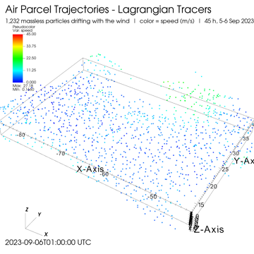
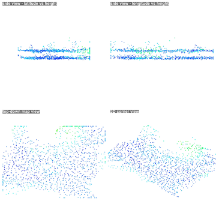
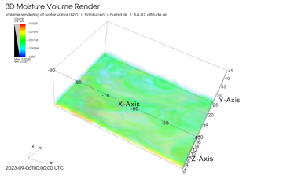

# MERRA-2 Atmospheric Visualization — Final Project

Justin Hatch · SCI 410 Scientific Visualization
Full project (code + all videos): https://github.com/jhatch3/merra2-visit-final

## What it does

Turns NASA MERRA-2 reanalysis data into 3D temperature, moisture, and wind videos
in VisIt. Region: western Atlantic (10–45 N, 90–40 W), 5–6 Sep 2023, 16 time steps.
The data's vertical axis is pressure, so I convert it to height
(`z = 7.5 * ln(1000 / pressure)`). Two paths into VisIt: a Python formatter, and a
C++ VisIt plugin that reads the raw `.nc4` directly. 15 videos total.

## Files

Python pipeline:
- `download_merra2.py` — download raw MERRA-2 files (needs NASA Earthdata login)
- `build_merra_series.py` — formatter: one variable, region-clipped, pressure→height, written as a VTK `.vtr` series + `.visit` index + `times.csv`
- `build_wind_vectors.py` — 3D wind vector field from U, V, OMEGA
- `advect_particles.py` — Lagrangian particle solver (this VisIt build has no streamline plot)
- `_make_test_merra.py` — synthetic test file, same shape as a real MERRA-2 file

VisIt scripts (`visit -cli -nowin -s <file>`):
- `make_movies_merra.py` — 6 cross-section movies (m1–m6)
- `make_flow_merra.py` — particle flow
- `make_flow_quad_merra.py` — particle flow, 4 panels
- `make_particles_merra.py` — wind vector glyphs
- `make_volume_merra.py` — moisture volume render (windowed/GPU only)

Plugin:
- `visit_plugin/MERRA2/` — C++ reader that opens raw `.nc4` and does pressure→height in `GetMesh`. Reads the full global grid (~8.7M points) vs the formatter's Atlantic slice (~144k).

## How to run

1. `python download_merra2.py …` (or `_make_test_merra.py` for a test file)
2. `python build_merra_series.py --var T --lat-min 10 --lat-max 45 --lon-min -90 --lon-max -40 --out ./vtr` (repeat for QV, WS; run `build_wind_vectors.py` + `advect_particles.py` for the flow videos)
3. `visit -cli -nowin -s make_movies_merra.py` (and the other `make_*.py`). Volume render must run windowed: `visit -cli -s make_volume_merra.py`
4. Encode the PNG frames to mp4 with ffmpeg

## Datasets

- Real: MERRA-2 `M2I3NPASM` (inst3_3d_asm_Np), 5–6 Sep 2023, 10–45 N / 90–40 W, 16 steps, from NASA GES DISC (Earthdata login).
- Test: `_make_test_merra.py` — synthetic file to test the pipeline without the 1.2 GB download.

## Videos

| Preview | Video |
|---|---|
|  | **[Particles following the wind](merra_flow_particles.mp4)** — 1,232 tracked particles |
|  | **[Same particles, 4 views](merra_flow_quad.mp4)** |
|  | **[Moisture volume render](merra_vol_qv.mp4)** |

Formatter (pre) vs plugin (post) — same cross-sections both ways; plugin covers the whole globe, formatter the Atlantic slice:

| | Pre (formatter) | Post (plugin) |
|---|---|---|
| Temperature, map | [watch](merra_m1_time.mp4) | [watch](merra_plugin_temp_map.mp4) |
| Temperature, vertical | [watch](merra_m2_vslice.mp4) | [watch](merra_plugin_temp_vert.mp4) |
| Temperature, 3D | [watch](merra_m3_orbit.mp4) | [watch](merra_plugin_temp_3d.mp4) |
| Moisture, map | [watch](merra_m4_qv_time.mp4) | [watch](merra_plugin_humidity_map.mp4) |
| Moisture, vertical | [watch](merra_m5_qv_vert.mp4) | [watch](merra_plugin_humidity_vert.mp4) |
| Wind speed | [watch](merra_m6_ws_time.mp4) | [watch](merra_plugin_wind_map.mp4) |

## Challenges

- Volume render crashed the engine on NaN (missing/below-ground values). Fix: replace NaN with 0.
- Volume render too slow headless (software ray caster, ~3 min/frame); ran windowed on the GPU, ~13 s/frame.
- VisIt 3.4 lacks the `rendererType`/`numSamples` volume attrs from older examples; setting them failed silently.
- Text annotations are global, not per-window, so the 4-panel labels stacked; added them with ffmpeg.
- Everything rendered sideways until I set the camera up-vector to the height axis.
- Misc: `ocean` color table doesn't exist; it's `colorByMagnitude` not `colorByMag`; `.visit` needs absolute paths; `SaveWindow` appends, so clear frames first.

## Time spent

~36 hours: ~22 in VisIt (incl. the plugin), ~14 in Python/data.
